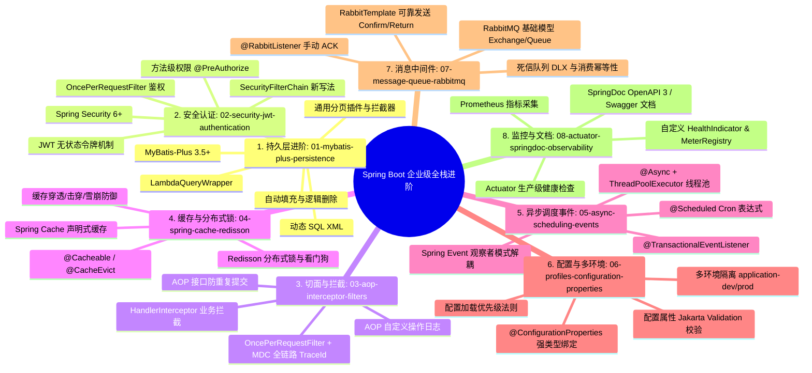

# Spring Boot 企业级实战进阶路线图与知识体系总览

> **本套进阶文档的目标**：
> 补齐当前 `study-spring-c` 项目中尚未包含的 **8 大核心企业级技术栈与生产架构**。
> 每一份文档均包含：**痛点分析、核心技术选型、底层原理深度拆解、语法逐行逐字剖析、完整生产级代码示范、避坑指南、分步落地实战步骤**。
> 你只需要按照这 8 份文档规划的路径，一步一个脚印地在项目中演练，就能真正掌握国内一线大厂与企业级后端开发所需的 Spring Boot 全套硬核本领！

---

## 一、 核心模块全景导航



---

## 二、 文档清单与学习推荐顺序

为了避免学习负担过重，建议按照 **由内而外、由易到难** 的四个阶段逐步推进：

| 阶段 | 文档编号与名称 | 对应核心技术栈 | 建议学习目标 |
| :--- | :--- | :--- | :--- |
| **第一阶段**<br>核心数据与安全基石 | [`01-mybatis-plus-persistence.md`](./01-mybatis-plus-persistence.md) | MyBatis-Plus 3.5+、动态 SQL、代码生成器 | 掌握国内主流企业最常用的持久层开发方式，摆脱单纯 JPA 的局限。 |
| | [`02-security-jwt-authentication.md`](./02-security-jwt-authentication.md) | Spring Security 6+、JJWT、无状态安全过滤器链 | 彻底打通“用户登录 -> 签发 JWT -> 携带 Token 访问 -> 角色权限拦截”闭环。 |
| **第二阶段**<br>系统横切与解耦设计 | [`03-aop-interceptor-filters.md`](./03-aop-interceptor-filters.md) | AOP 切面、HandlerInterceptor、MDC 链路追踪 | 学会优雅地剥离通用业务，掌握日志打印、耗时统计、防重复提交与链路追踪。 |
| | [`05-async-scheduling-events.md`](./05-async-scheduling-events.md) | 自定义线程池、@Async、@Scheduled、Spring Event | 掌握异步高吞吐处理、批处理任务与领域事件解耦。 |
| **第三阶段**<br>高并发缓存与分布式 | [`04-spring-cache-redisson.md`](./04-spring-cache-redisson.md) | Spring Cache 注解、Redisson 分布式锁 | 从单机迈向分布式并发控制，防御缓存三大灾难。 |
| | [`07-message-queue-rabbitmq.md`](./07-message-queue-rabbitmq.md) | RabbitMQ、可靠消息投递、手动 ACK、死信队列 | 掌握现代微服务与高并发架构中的削峰填谷与最终一致性。 |
| **第四阶段**<br>工程化配置与生产运维 | [`06-profiles-configuration-properties.md`](./06-profiles-configuration-properties.md) | 多环境 Profiles、@ConfigurationProperties | 学会标准的工程化配置隔离与类型安全属性绑定。 |
| | [`08-actuator-springdoc-observability.md`](./08-actuator-springdoc-observability.md) | Swagger 3 (SpringDoc)、Actuator 监控、Prometheus | 输出高质量接口文档，实现线上服务的可观测性与健康度量。 |

---

## 三、 当前工程（`study-spring-c`）改造实战步骤建议

当你准备在当前项目中敲代码实战时，可以按以下节奏逐步重构或新增模块：

```text
步骤 1：新建一个 `user` 模块或 `order` 模块，引入 MyBatis-Plus 练习 CRUD 与复杂查询。
步骤 2：在项目中配置 Spring Security + JWT，让已有的 `/api/books` 接口增加权限校验。
步骤 3：编写 `@LogOperation` 切面与 `TraceIdFilter`，给所有的 Controller 接口加上操作日志与链路追踪。
步骤 4：引入 Redisson，将书籍详情查询升级为 `@Cacheable` 声明式缓存，并将阅读量更新改用分布式并发控制。
步骤 5：增加用户注册功能，发布 `UserRegisteredEvent` 事件，异步触发 `@Async` 发送欢迎消息。
步骤 6：配置 `application-dev.yaml` 与 `application-prod.yaml` 隔离不同环境的数据库/Redis连接。
步骤 7：启动本地 Docker RabbitMQ，模拟“借书成功后发送 MQ 消息通知”的完整流转与手动 ACK。
步骤 8：为所有 Controller 编写 Swagger 3 注解，并开启 Actuator 监控端点，查看 `/actuator/health` 与 `/swagger-ui.html`。
```

---

请点击下方具体文档链接开始第一篇学习：
👉 [01. MyBatis-Plus 持久层实战与动态 SQL](./01-mybatis-plus-persistence.md)
