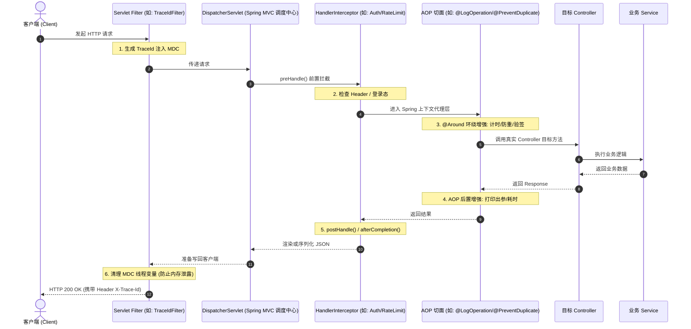

# 03. Spring 核心切面与拦截器：AOP 日志/防刷 + Interceptor + Filter 链路追踪

> **模块定位**：横切关注点与系统可观测性层  
> **核心技术栈**：Spring AOP (AspectJ) / Spring MVC Interceptor / Servlet Filter / SLF4J MDC  
> **学习目标**：彻底分清 Filter、Interceptor 和 AOP 的执行时机与适用场景，掌握使用 AOP 编写自定义操作日志切面、接口防重复提交切面，使用 Interceptor 拦截非法请求，使用 Filter + MDC 实现全链路 TraceId 日志追踪。

---

## 一、 Filter vs Interceptor vs AOP 三者执行时机与边界对比

在 Spring Boot 中，一个 HTTP 请求从进入服务器到最终返回客户端，会依次经过不同层级的拦截与增强：



| 维度 | Servlet Filter (过滤器) | HandlerInterceptor (拦截器) | Spring AOP (面向切面编程) |
| :--- | :--- | :--- | :--- |
| **所属体系** | Java EE / Servlet 规范标准 | Spring MVC 体系 | Spring Core (IOC / AOP 框架) |
| **拦截粒度** | 最外层，基于 URL 路径模式匹配 | 基于 Controller 处理器方法映射 | 最细粒度，支持任意 Bean 的任意方法/注解 |
| **上下文感知**| 无法直接拿到 Spring Controller 内部上下文 | 可直接获取 `HandlerMethod`、反射获取方法注解 | 可直接获取方法入参、返回值、执行抛出的真实异常 |
| **典型应用** | 全链路 TraceId 注入、编码过滤、跨域 CORS | 权限黑白名单、防刷限流、用户会话装配 | 操作审计日志、性能耗时统计、接口防重提交、分布式锁 |

---

## 二、 依赖引入配置（`build.gradle`）

Spring Boot 默认已包含 Filter 和 Interceptor，只需额外引入 AOP Starter：

```groovy
dependencies {
    // Spring Boot AOP 切面支持（内置 AspectJ）
    implementation 'org.springframework.boot:spring-boot-starter-aop'
    
    // Redis 支持（用于接口防重复提交）
    implementation 'org.springframework.boot:spring-boot-starter-data-redis'
}
```

---

## 三、 实战一：AOP 打造生产级【接口耗时与操作审计日志】

### 1. 自定义注解 `@LogOperation`

```java
package cn.self.studyspringc.common.aop.annotation;

import java.lang.annotation.Documented;
import java.lang.annotation.ElementType;
import java.lang.annotation.Retention;
import java.lang.annotation.RetentionPolicy;
import java.lang.annotation.Target;

/**
 * 操作日志注解：标注在 Controller 或 Service 方法上，自动记录调用日志与执行耗时
 */
@Target(ElementType.METHOD)
@Retention(RetentionPolicy.RUNTIME)
@Documented
public @interface LogOperation {
    /**
     * 操作模块或业务描述（例如："图书模块-新增书籍"）
     */
    String value() default "";

    /**
     * 是否打印出参结果（默认 true，若返回超大文件流或长列表可设为 false）
     */
    boolean logResult() default true;
}
```

### 2. AOP 切面实现类 `LogAspect.java`

```java
package cn.self.studyspringc.common.aop.aspect;

import cn.self.studyspringc.common.aop.annotation.LogOperation;
import com.fasterxml.jackson.databind.ObjectMapper;
import jakarta.servlet.http.HttpServletRequest;
import lombok.RequiredArgsConstructor;
import lombok.extern.slf4j.Slf4j;
import org.aspectj.lang.ProceedingJoinPoint;
import org.aspectj.lang.annotation.Around;
import org.aspectj.lang.annotation.Aspect;
import org.aspectj.lang.annotation.Pointcut;
import org.aspectj.lang.reflect.MethodSignature;
import org.springframework.stereotype.Component;
import org.springframework.web.context.request.RequestContextHolder;
import org.springframework.web.context.request.ServletRequestAttributes;

import java.lang.reflect.Method;
import java.util.Arrays;

/**
 * =====================================================================================
 * 【Spring AOP 语法与执行流程完全拆解】
 * =====================================================================================
 * 
 * 1. @Aspect: 声明该类为一个切面类。
 * 2. @Pointcut("@annotation(...)"): 定义切入点，表示所有标注了 @LogOperation 的方法都会被拦截。
 * 3. @Around("pointcutName()"): 环绕通知！最强大的通知类型，可以在目标方法执行前、执行后、甚至发生异常时完全掌控流程。
 * 4. ProceedingJoinPoint: 连接点对象。
 *    - joinPoint.proceed(): 核心指令，触发调用目标 Controller 方法。
 *    - joinPoint.getSignature(): 获取目标方法的类名、方法名、参数类型。
 *    - joinPoint.getArgs(): 获取实际传入的参数值数组。
 * =====================================================================================
 */
@Slf4j
@Aspect
@Component
@RequiredArgsConstructor
public class LogAspect {

    private final ObjectMapper objectMapper;

    @Pointcut("@annotation(cn.self.studyspringc.common.aop.annotation.LogOperation)")
    public void logPointcut() {}

    @Around("logPointcut()")
    public Object around(ProceedingJoinPoint joinPoint) throws Throwable {
        long startTime = System.currentTimeMillis();

        // 1. 获取当前请求的 HTTP 上下文
        ServletRequestAttributes attributes = (ServletRequestAttributes) RequestContextHolder.getRequestAttributes();
        HttpServletRequest request = attributes != null ? attributes.getRequest() : null;

        // 2. 反射获取注解信息
        MethodSignature signature = (MethodSignature) joinPoint.getSignature();
        Method method = signature.getMethod();
        LogOperation logAnnotation = method.getAnnotation(LogOperation.class);
        String operationDesc = logAnnotation != null ? logAnnotation.value() : "";

        String uri = request != null ? request.getRequestURI() : "N/A";
        String httpMethod = request != null ? request.getMethod() : "N/A";
        String className = joinPoint.getTarget().getClass().getSimpleName();
        String methodName = method.getName();

        log.info("====== [AOP 日志开始] 模块: [{}] | 请求: [{} {}] | 方法: [{}#{}] ======",
                operationDesc, httpMethod, uri, className, methodName);

        // 打印入参
        try {
            log.info("--> 入参数据: {}", objectMapper.writeValueAsString(joinPoint.getArgs()));
        } catch (Exception e) {
            log.info("--> 入参数据: {}", Arrays.toString(joinPoint.getArgs()));
        }

        Object result;
        try {
            // 3. 执行真正的目标业务方法
            result = joinPoint.proceed();
        } catch (Throwable ex) {
            long costTime = System.currentTimeMillis() - startTime;
            log.error("<-- [AOP 异常] 耗时: [{} ms] | 异常信息: {}", costTime, ex.getMessage(), ex);
            // 务必重新抛出异常，交给 GlobalExceptionHandler 统一捕获
            throw ex;
        }

        long costTime = System.currentTimeMillis() - startTime;

        // 4. 打印出参与耗时统计
        if (logAnnotation != null && logAnnotation.logResult()) {
            try {
                log.info("<-- [AOP 完成] 耗时: [{} ms] | 出参: {}", costTime, objectMapper.writeValueAsString(result));
            } catch (Exception e) {
                log.info("<-- [AOP 完成] 耗时: [{} ms] | 出参: {}", costTime, result);
            }
        } else {
            log.info("<-- [AOP 完成] 耗时: [{} ms]", costTime);
        }

        return result;
    }
}
```

---

## 四、 实战二：AOP 打造接口【防重复提交切面】

### 1. 防重提交注解 `@PreventDuplicateSubmit`

```java
package cn.self.studyspringc.common.aop.annotation;

import java.lang.annotation.*;

@Target(ElementType.METHOD)
@Retention(RetentionPolicy.RUNTIME)
@Documented
public @interface PreventDuplicateSubmit {
    /**
     * 防重锁定间隔时间（默认 3 秒内不允许重复提交）
     */
    long intervalSeconds() default 3;

    /**
     * 提示消息
     */
    String message() default "您点击太快了，请稍后再试！";
}
```

### 2. 切面实现类 `PreventDuplicateSubmitAspect.java`

```java
package cn.self.studyspringc.common.aop.aspect;

import cn.self.studyspringc.common.aop.annotation.PreventDuplicateSubmit;
import jakarta.servlet.http.HttpServletRequest;
import lombok.RequiredArgsConstructor;
import lombok.extern.slf4j.Slf4j;
import org.aspectj.lang.ProceedingJoinPoint;
import org.aspectj.lang.annotation.Around;
import org.aspectj.lang.annotation.Aspect;
import org.springframework.data.redis.core.StringRedisTemplate;
import org.springframework.stereotype.Component;
import org.springframework.util.DigestUtils;
import org.springframework.web.context.request.RequestContextHolder;
import org.springframework.web.context.request.ServletRequestAttributes;

import java.nio.charset.StandardCharsets;
import java.time.Duration;
import java.util.Arrays;

/**
 * 利用 Redis SETNX (setIfAbsent) 保证接口幂等与防刷
 */
@Slf4j
@Aspect
@Component
@RequiredArgsConstructor
public class PreventDuplicateSubmitAspect {

    private static final String DUP_KEY_PREFIX = "prevent_dup:";
    private final StringRedisTemplate redisTemplate;

    @Around("@annotation(preventAnnotation)")
    public Object around(ProceedingJoinPoint joinPoint, PreventDuplicateSubmit preventAnnotation) throws Throwable {
        ServletRequestAttributes attributes = (ServletRequestAttributes) RequestContextHolder.getRequestAttributes();
        if (attributes == null) {
            return joinPoint.proceed();
        }

        HttpServletRequest request = attributes.getRequest();
        String uri = request.getRequestURI();
        
        // 获取客户端 IP 或用户标识
        String clientIp = request.getRemoteAddr();
        String argsString = Arrays.toString(joinPoint.getArgs());

        // 计算参数 MD5 Hash，避免超长 Key
        String paramHash = DigestUtils.md5DigestAsHex(argsString.getBytes(StandardCharsets.UTF_8));
        String redisKey = DUP_KEY_PREFIX + uri + ":" + clientIp + ":" + paramHash;

        long interval = preventAnnotation.intervalSeconds();

        // 尝试写入 Redis (SET key value EX interval NX)
        Boolean acquired = redisTemplate.opsForValue().setIfAbsent(
                redisKey, 
                "LOCKED", 
                Duration.ofSeconds(interval)
        );

        if (Boolean.FALSE.equals(acquired)) {
            log.warn("检测到重复提交请求: URI=[{}], IP=[{}]", uri, clientIp);
            throw new IllegalStateException(preventAnnotation.message());
        }

        return joinPoint.proceed();
    }
}
```

---

## 五、 实战三：`HandlerInterceptor` 实现请求业务拦截器

```java
package cn.self.studyspringc.common.interceptor;

import jakarta.servlet.http.HttpServletRequest;
import jakarta.servlet.http.HttpServletResponse;
import lombok.extern.slf4j.Slf4j;
import org.springframework.stereotype.Component;
import org.springframework.web.method.HandlerMethod;
import org.springframework.web.servlet.HandlerInterceptor;
import org.springframework.web.servlet.ModelAndView;

/**
 * 自定义请求处理拦截器
 */
@Slf4j
@Component
public class PerformanceInterceptor implements HandlerInterceptor {

    private static final String START_TIME_ATTR = "REQUEST_START_TIME";

    /**
     * 1. preHandle: 在 Controller 执行前调用。
     * 返回 true: 继续放行；返回 false: 拦截中断请求。
     */
    @Override
    public boolean preHandle(HttpServletRequest request, HttpServletResponse response, Object handler) {
        request.setAttribute(START_TIME_ATTR, System.currentTimeMillis());

        if (handler instanceof HandlerMethod handlerMethod) {
            log.debug("Interceptor 匹配到处理方法: {}#{}",
                    handlerMethod.getBeanType().getSimpleName(),
                    handlerMethod.getMethod().getName());
        }
        return true;
    }

    /**
     * 2. postHandle: Controller 执行完成，但尚未渲染视图时调用。
     */
    @Override
    public void postHandle(HttpServletRequest request, HttpServletResponse response, Object handler, ModelAndView modelAndView) {
        // 前后端分离通常返回 JSON，此时 modelAndView 为 null
    }

    /**
     * 3. afterCompletion: 整个请求生命周期结束（包括异常响应写回之后）调用，适合做资源释放清理。
     */
    @Override
    public void afterCompletion(HttpServletRequest request, HttpServletResponse response, Object handler, Exception ex) {
        Long startTime = (Long) request.getAttribute(START_TIME_ATTR);
        if (startTime != null) {
            long totalCost = System.currentTimeMillis() - startTime;
            log.debug("HTTP 请求 [{} {}] 完整生命周期总耗时: {} ms", request.getMethod(), request.getRequestURI(), totalCost);
        }
    }
}
```

### 注册拦截器（`WebMvcConfigurer`）

```java
package cn.self.studyspringc.common.config;

import cn.self.studyspringc.common.interceptor.PerformanceInterceptor;
import lombok.RequiredArgsConstructor;
import org.springframework.context.annotation.Configuration;
import org.springframework.web.servlet.config.annotation.InterceptorRegistry;
import org.springframework.web.servlet.config.annotation.WebMvcConfigurer;

@Configuration
@RequiredArgsConstructor
public class WebMvcConfig implements WebMvcConfigurer {

    private final PerformanceInterceptor performanceInterceptor;

    @Override
    public void addInterceptors(InterceptorRegistry registry) {
        registry.addInterceptor(performanceInterceptor)
                .addPathPatterns("/api/**")                      // 拦截所有 /api 开头的请求
                .excludePathPatterns("/api/auth/**", "/swagger-ui/**"); // 放行无需拦截的白名单
    }
}
```

---

## 六、 实战四：`OncePerRequestFilter` + MDC 实现全链路日志追踪（TraceId）

在分布式微服务和排查线上 Bug 时，我们希望**一个请求产生的所有日志都携带同一个 TraceId**。

### 1. 链路追踪过滤器 `TraceIdFilter.java`

```java
package cn.self.studyspringc.common.filter;

import jakarta.servlet.FilterChain;
import jakarta.servlet.ServletException;
import jakarta.servlet.http.HttpServletRequest;
import jakarta.servlet.http.HttpServletResponse;
import org.slf4j.MDC;
import org.springframework.core.Ordered;
import org.springframework.core.annotation.Order;
import org.springframework.stereotype.Component;
import org.springframework.util.StringUtils;
import org.springframework.web.filter.OncePerRequestFilter;

import java.io.IOException;
import java.util.UUID;

/**
 * 全链路日志追踪过滤器：
 * 优先级最高（HIGHEST_PRECEDENCE），在所有日志打印前将 traceId 塞入 SLF4J MDC 线程上下文中。
 */
@Component
@Order(Ordered.HIGHEST_PRECEDENCE)
public class TraceIdFilter extends OncePerRequestFilter {

    public static final String TRACE_ID_HEADER = "X-Trace-Id";
    public static final String MDC_TRACE_ID_KEY = "traceId";

    @Override
    protected void doFilterInternal(
            HttpServletRequest request,
            HttpServletResponse response,
            FilterChain filterChain
    ) throws ServletException, IOException {
        try {
            // 1. 如果上游调用方传递了 TraceId 则复用，否则自动生成 32 位 UUID
            String traceId = request.getHeader(TRACE_ID_HEADER);
            if (!StringUtils.hasText(traceId)) {
                traceId = UUID.randomUUID().toString().replace("-", "");
            }

            // 2. 塞入 SLF4J MDC 容器中（底层基于 ThreadLocal）
            MDC.put(MDC_TRACE_ID_KEY, traceId);

            // 3. 在 HTTP 响应头中回传 X-Trace-Id，方便前端/调用方排查问题
            response.setHeader(TRACE_ID_HEADER, traceId);

            // 4. 放行
            filterChain.doFilter(request, response);
        } finally {
            // 5. 关键安全点：请求结束时必须清理 MDC，防止 Tomcat 线程池复用导致 TraceId 串味或内存泄露
            MDC.remove(MDC_TRACE_ID_KEY);
        }
    }
}
```

### 2. 日志配置文件更新（`src/main/resources/logback-spring.xml`）

在 logback 日志格式中加入 `%X{traceId}`，所有的 `log.info(...)` 就会自动打印链路 ID：

```xml
<?xml version="1.0" encoding="UTF-8"?>
<configuration>
    <property name="CONSOLE_LOG_PATTERN"
              value="%d{yyyy-MM-dd HH:mm:ss.SSS} [%thread] [%X{traceId}] %-5level %logger{36} - %msg%n"/>

    <appender name="CONSOLE" class="ch.qos.logback.core.ConsoleAppender">
        <encoder>
            <pattern>${CONSOLE_LOG_PATTERN}</pattern>
            <charset>UTF-8</charset>
        </encoder>
    </appender>

    <root level="INFO">
        <appender-ref ref="CONSOLE"/>
    </root>
</configuration>
```

---

## 七、 Controller 使用示范与测试验证

```java
@RestController
@RequestMapping("/api/books")
@RequiredArgsConstructor
public class BookController {

    private final BookService bookService;

    @LogOperation("图书模块-新增书籍")
    @PreventDuplicateSubmit(intervalSeconds = 5, message = "请勿频繁重复创建图书！")
    @PostMapping
    public ResponseEntity<BookResponse> create(@Valid @RequestBody BookRequest request) {
        BookResponse response = bookService.create(request);
        return ResponseEntity.created(URI.create("/api/books/" + response.id())).body(response);
    }
}
```

### 验证输出效果：
发起请求后，控制台将输出携带 `[traceId]` 的清晰全流程日志：
```text
2026-08-16 23:00:01.120 [http-nio-8080-exec-1] [a7c8f9103e2b4f91] INFO  c.s.s.c.a.a.LogAspect - ====== [AOP 日志开始] 模块: [图书模块-新增书籍] | 请求: [POST /api/books] ======
2026-08-16 23:00:01.125 [http-nio-8080-exec-1] [a7c8f9103e2b4f91] INFO  c.s.s.c.a.a.LogAspect - --> 入参数据: [{"title":"深入理解 Java 虚拟机","author":"周志明"}]
2026-08-16 23:00:01.150 [http-nio-8080-exec-1] [a7c8f9103e2b4f91] INFO  c.s.s.c.a.a.LogAspect - <-- [AOP 完成] 耗时: [25 ms] | 出参: {"id":1,"title":"深入理解 Java 虚拟机","author":"周志明"}
```

---

👉 **下一篇推荐学习**：[04. 进阶缓存与分布式锁：Spring Cache 声明式缓存 + Redisson 实战 + 缓存三灾防御](./04-spring-cache-redisson.md)
