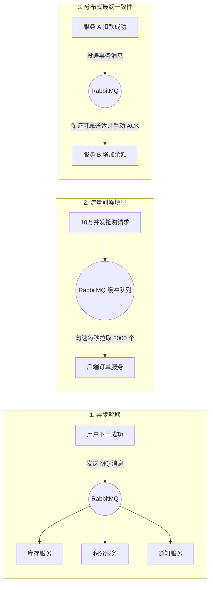

# 07. 消息中间件实战：RabbitMQ 生产者、消费者 ACK、死信队列与可靠投递

> **模块定位**：分布式异步通信与削峰填谷消息层  
> **核心技术栈**：RabbitMQ 3.13+ / Spring AMQP (RabbitTemplate) / Jackson JSON 序列化 / Docker Compose  
> **学习目标**：掌握现代分布式微服务中最核心的消息中间件架构；彻底搞懂 Exchange（直连/主题/扇出）、Queue、RoutingKey 路由模型；掌握生产者发送确认（Confirm & Returns）、消费者手动 ACK、死信队列（DLX）延迟重试以及基于 Redis 的消息消费幂等性防御。

---

## 一、 为什么企业级高并发系统必须使用消息队列（MQ）？

在单体或微服务架构演进中，消息队列承担着不可替代的 **三大核心价值**：



---

## 二、 依赖引入与 Docker Compose 启动

### 1. `build.gradle` 依赖

```groovy
dependencies {
    // Spring Boot AMQP (RabbitMQ) 核心 Starter
    implementation 'org.springframework.boot:spring-boot-starter-amqp'
    
    // 测试支持
    testImplementation 'org.springframework.amqp:spring-rabbit-test'
}
```

### 2. 更新 `docker-compose.yml` 添加 RabbitMQ 容器

```yaml
services:
  rabbitmq:
    image: rabbitmq:3.13-management-alpine
    container_name: study-rabbitmq
    restart: unless-stopped
    ports:
      - "5672:5672"    # AMQP 消息通信端口
      - "15672:15672"  # RabbitMQ Web 图形化管理控制台端口 (默认账号密码: guest / guest)
    environment:
      RABBITMQ_DEFAULT_USER: guest
      RABBITMQ_DEFAULT_PASS: guest
    volumes:
      - rabbitmq_data:/var/lib/rabbitmq

volumes:
  rabbitmq_data:
    driver: local
```

在 `application.yaml` 中配置连接：

```yaml
spring:
  rabbitmq:
    host: ${RABBITMQ_HOST:localhost}
    port: ${RABBITMQ_PORT:5672}
    username: ${RABBITMQ_USER:guest}
    password: ${RABBITMQ_PASSWORD:guest}
    # 开启生产者发送确认机制 (ConfirmCallback)
    publisher-confirm-type: correlated
    # 开启消息路由失败退回机制 (ReturnsCallback)
    publisher-returns: true
    listener:
      simple:
        # 开启消费者手动 ACK 确认模式
        acknowledge-mode: manual
        # 单个消费者并发拉取的预取数量 (Prefetch)
        prefetch: 1
```

---

## 三、 RabbitMQ 核心模型与拓扑配置（`RabbitMQConfig.java`）

```java
package cn.self.studyspringc.common.config;

import lombok.extern.slf4j.Slf4j;
import org.springframework.amqp.core.*;
import org.springframework.amqp.rabbit.connection.ConnectionFactory;
import org.springframework.amqp.rabbit.core.RabbitTemplate;
import org.springframework.amqp.support.converter.Jackson2JsonMessageConverter;
import org.springframework.amqp.support.converter.MessageConverter;
import org.springframework.context.annotation.Bean;
import org.springframework.context.annotation.Configuration;

import java.util.HashMap;
import java.util.Map;

/**
 * =====================================================================================
 * 【RabbitMQ 拓扑结构设计与死信队列机制】
 * =====================================================================================
 * 
 * 1. 业务主流程：
 *    - 业务交换机 (ORDER_EXCHANGE) -> 绑定 RoutingKey ("order.create") -> 业务队列 (ORDER_QUEUE)
 * 
 * 2. 死信队列（Dead Letter Exchange / DLX）机制：
 *    - 当业务队列中的消息发生以下情况时，会变成“死信（Dead Letter）”：
 *        a. 消费者 basicNack/basicReject 且 requeue=false（消费失败拒绝重新入队）；
 *        b. 消息在队列中超过 TTL 存活时间未被消费；
 *        c. 队列长度达到最大上限。
 *    - 业务队列通过配置 `x-dead-letter-exchange` 自动将死信路由转发至死信队列 (ORDER_DLQ)，
 *      由专门的死信消费者进行人工告警或入库补偿，实现 100% 消息不丢失！
 * =====================================================================================
 */
@Slf4j
@Configuration
public class RabbitMQConfig {

    // 业务主交换机与队列
    public static final String BOOK_ORDER_EXCHANGE = "exchange.book.order";
    public static final String BOOK_ORDER_QUEUE = "queue.book.order";
    public static final String BOOK_ORDER_ROUTING_KEY = "book.order.create";

    // 死信交换机与死信队列
    public static final String BOOK_ORDER_DLX_EXCHANGE = "exchange.book.order.dlx";
    public static final String BOOK_ORDER_DLQ_QUEUE = "queue.book.order.dlq";
    public static final String BOOK_ORDER_DLQ_ROUTING_KEY = "book.order.dlq";

    /**
     * 1. 配置全局 JSON 序列化器（替代原生 JDK 序列化）
     */
    @Bean
    public MessageConverter jsonMessageConverter() {
        return new Jackson2JsonMessageConverter();
    }

    /**
     * 2. 声明业务主交换机 (TopicExchange 支持通配符路由)
     */
    @Bean
    public TopicExchange bookOrderExchange() {
        return new TopicExchange(BOOK_ORDER_EXCHANGE, true, false);
    }

    /**
     * 3. 声明业务主队列，并绑定死信交换机参数
     */
    @Bean
    public Queue bookOrderQueue() {
        Map<String, Object> args = new HashMap<>();
        // 绑定死信交换机
        args.put("x-dead-letter-exchange", BOOK_ORDER_DLX_EXCHANGE);
        // 绑定死信 RoutingKey
        args.put("x-dead-letter-routing-key", BOOK_ORDER_DLQ_ROUTING_KEY);
        // 消息在主队列的 TTL 过期时间（如 10 分钟 = 600000 毫秒）
        args.put("x-message-ttl", 600000);

        return new Queue(BOOK_ORDER_QUEUE, true, false, false, args);
    }

    /**
     * 4. 绑定业务交换机与队列
     */
    @Bean
    public Binding bookOrderBinding() {
        return BindingBuilder.bind(bookOrderQueue())
                .to(bookOrderExchange())
                .with(BOOK_ORDER_ROUTING_KEY);
    }

    /**
     * 5. 声明死信交换机
     */
    @Bean
    public DirectExchange bookOrderDlxExchange() {
        return new DirectExchange(BOOK_ORDER_DLX_EXCHANGE, true, false);
    }

    /**
     * 6. 声明死信队列
     */
    @Bean
    public Queue bookOrderDlqQueue() {
        return new Queue(BOOK_ORDER_DLQ_QUEUE, true);
    }

    /**
     * 7. 绑定死信交换机与死信队列
     */
    @Bean
    public Binding bookOrderDlqBinding() {
        return BindingBuilder.bind(bookOrderDlqQueue())
                .to(bookOrderDlxExchange())
                .with(BOOK_ORDER_DLQ_ROUTING_KEY);
    }

    /**
     * 8. 配置高可靠生产投递回调 (Confirm & Return)
     */
    @Bean
    public RabbitTemplate rabbitTemplate(ConnectionFactory connectionFactory) {
        RabbitTemplate rabbitTemplate = new RabbitTemplate(connectionFactory);
        rabbitTemplate.setMessageConverter(jsonMessageConverter());

        // 生产者 Confirm 机制：消息是否成功到达 Broker 交换机
        rabbitTemplate.setConfirmCallback((correlationData, ack, cause) -> {
            if (ack) {
                log.debug("MQ 消息成功送达交换机, correlationData={}", correlationData);
            } else {
                log.error("MQ 消息未能送达交换机! 失败原因: {}, correlationData={}", cause, correlationData);
            }
        });

        // 生产者 Returns 机制：消息到达交换机但未能匹配到任何队列时触发
        rabbitTemplate.setReturnsCallback(returned -> {
            log.error("MQ 消息路由队列失败 (不可达): replyCode={}, replyText={}, exchange={}, routingKey={}, message={}",
                    returned.getReplyCode(), returned.getReplyText(), returned.getExchange(),
                    returned.getRoutingKey(), returned.getMessage());
        });

        return rabbitTemplate;
    }
}
```

---

## 四、 生产者可靠投递实战（`OrderMessageProducer.java`）

```java
package cn.self.studyspringc.book.mq;

import cn.self.studyspringc.common.config.RabbitMQConfig;
import lombok.RequiredArgsConstructor;
import lombok.extern.slf4j.Slf4j;
import org.springframework.amqp.rabbit.connection.CorrelationData;
import org.springframework.amqp.rabbit.core.RabbitTemplate;
import org.springframework.stereotype.Service;

import java.util.UUID;

/**
 * 消息传输 DTO
 */
public record BookOrderMessage(
        String messageId,
        Long orderId,
        Long bookId,
        String username,
        Integer quantity
) {}

@Slf4j
@Service
@RequiredArgsConstructor
public class OrderMessageProducer {

    private final RabbitTemplate rabbitTemplate;

    /**
     * 发送订单创建消息
     */
    public void sendOrderCreateMessage(Long orderId, Long bookId, String username, Integer quantity) {
        String messageId = UUID.randomUUID().toString().replace("-", "");
        BookOrderMessage message = new BookOrderMessage(messageId, orderId, bookId, username, quantity);

        // 附带关联唯一标识
        CorrelationData correlationData = new CorrelationData(messageId);

        log.info("--> [MQ 生产者] 正在投递图书下单消息: ID=[{}], 订单号=[{}]", messageId, orderId);

        rabbitTemplate.convertAndSend(
                RabbitMQConfig.BOOK_ORDER_EXCHANGE,
                RabbitMQConfig.BOOK_ORDER_ROUTING_KEY,
                message,
                correlationData
        );
    }
}
```

---

## 五、 消费者手动 ACK 与幂等性处理（`OrderMessageConsumer.java`）

```java
package cn.self.studyspringc.book.mq;

import cn.self.studyspringc.common.config.RabbitMQConfig;
import com.rabbitmq.client.Channel;
import lombok.RequiredArgsConstructor;
import lombok.extern.slf4j.Slf4j;
import org.springframework.amqp.core.Message;
import org.springframework.amqp.rabbit.annotation.RabbitListener;
import org.springframework.data.redis.core.StringRedisTemplate;
import org.springframework.stereotype.Component;

import java.io.IOException;
import java.time.Duration;

/**
 * =====================================================================================
 * 【消费者手动确认与幂等性消费完全实战】
 * =====================================================================================
 * 
 * 1. 为什么必须手动 ACK？
 *    - 默认的自动 ACK 模式下，Spring 刚从 RabbitMQ 收到消息就会立刻回复 ACK；
 *      若随后在执行数据库业务时宕机或抛异常，该消息在 MQ 中已被删除，造成严重的消息丢失！
 *    - 手动 ACK 模式下，只有当业务逻辑【全部执行成功】后，才调用 `channel.basicAck()`。
 * 
 * 2. 消费幂等性（防重复消费）：
 *    - 网络抖动可能导致生产者重试或 MQ 重复投递相同消息。
 *    - 利用 Redis SETNX 记录已消费的 messageId，若已存在则直接 ACK 跳过，防止重复扣库存或重复发货。
 * =====================================================================================
 */
@Slf4j
@Component
@RequiredArgsConstructor
public class OrderMessageConsumer {

    private static final String CONSUMED_KEY_PREFIX = "mq:consumed:order:";
    private final StringRedisTemplate redisTemplate;

    @RabbitListener(queues = RabbitMQConfig.BOOK_ORDER_QUEUE)
    public void handleOrderMessage(BookOrderMessage orderMessage, Message amqpMessage, Channel channel) throws IOException {
        long deliveryTag = amqpMessage.getMessageProperties().getDeliveryTag();
        String messageId = orderMessage.messageId();

        log.info("--> [MQ 消费者] 收到图书订单消息: messageId=[{}], orderId=[{}]", messageId, orderMessage.orderId());

        // 1. 幂等性检查：利用 Redis SETNX 占位（保持 24 小时）
        String idempotenceKey = CONSUMED_KEY_PREFIX + messageId;
        Boolean isFirstConsume = redisTemplate.opsForValue().setIfAbsent(idempotenceKey, "PROCESSING", Duration.ofDays(1));

        if (Boolean.FALSE.equals(isFirstConsume)) {
            log.warn("检测到重复消息投递，已幂等忽略: messageId=[{}]", messageId);
            // 手动确认已处理，避免 MQ 反复重试
            channel.basicAck(deliveryTag, false);
            return;
        }

        try {
            // 2. 执行真实核心业务（例如调用库存服务扣减、发短信通知等）
            processOrderBusiness(orderMessage);

            // 3. 标记消费状态为 DONE
            redisTemplate.opsForValue().set(idempotenceKey, "DONE", Duration.ofDays(1));

            // 4. 手动确认：第一个参数 deliveryTag 唯一编号，第二个参数 multiple=false 表示不批量确认
            channel.basicAck(deliveryTag, false);
            log.info("<-- [MQ 消费者] 消息处理成功并完成手动 ACK: messageId=[{}]", messageId);

        } catch (Exception ex) {
            log.error("消费消息发生严重异常: messageId=[{}], 原因: {}", messageId, ex.getMessage(), ex);

            // 删除 Redis 幂等标记，允许后续重试
            redisTemplate.delete(idempotenceKey);

            // 5. 异常拒绝：basicNack(deliveryTag, multiple=false, requeue=false)
            // 设置 requeue=false 会让消息直接进入【死信队列 (DLQ)】，防止在主队列死循环重试打爆 CPU！
            channel.basicNack(deliveryTag, false, false);
        }
    }

    /**
     * 监听死信队列：专门用于监控和人工告警
     */
    @RabbitListener(queues = RabbitMQConfig.BOOK_ORDER_DLQ_QUEUE)
    public void handleDeadLetterMessage(BookOrderMessage deadMessage, Message amqpMessage, Channel channel) throws IOException {
        long deliveryTag = amqpMessage.getMessageProperties().getDeliveryTag();
        log.error("⚠️ [死信告警] 发现无法正常消费的死信订单消息! 订单详情: {}", deadMessage);

        // 生产实践：将死信记录持久化到 MongoDB / MySQL 失败日志表，并触发飞书/钉钉报警机器人通知工程师
        // 最终确认死信消息已被捕获
        channel.basicAck(deliveryTag, false);
    }

    private void processOrderBusiness(BookOrderMessage message) throws Exception {
        // 模拟业务处理
        if (message.quantity() > 1000) {
            throw new IllegalArgumentException("单次购买数量超过上限，触发业务异常测试死信队列");
        }
        Thread.sleep(200);
    }
}
```

---

## 六、 实战验证与测试

```java
@SpringBootTest
class RabbitMQTest {

    @Autowired
    private OrderMessageProducer orderMessageProducer;

    @Test
    void testSendNormalOrder() throws Exception {
        orderMessageProducer.sendOrderCreateMessage(1001L, 1L, "zhang_san", 2);
        Thread.sleep(2000);
    }

    @Test
    void testDeadLetterFlow() throws Exception {
        // 数量 9999 会触发异常并自动流转至死信队列
        orderMessageProducer.sendOrderCreateMessage(1002L, 2L, "li_si", 9999);
        Thread.sleep(2000);
    }
}
```

---

👉 **下一篇推荐学习**：[08. 生产级运维监控与自动化 API 文档：SpringDoc OpenAPI 3 + Actuator](./08-actuator-springdoc-observability.md)
